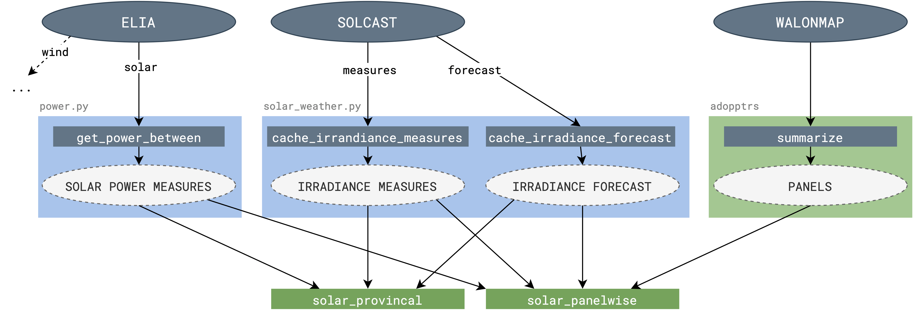
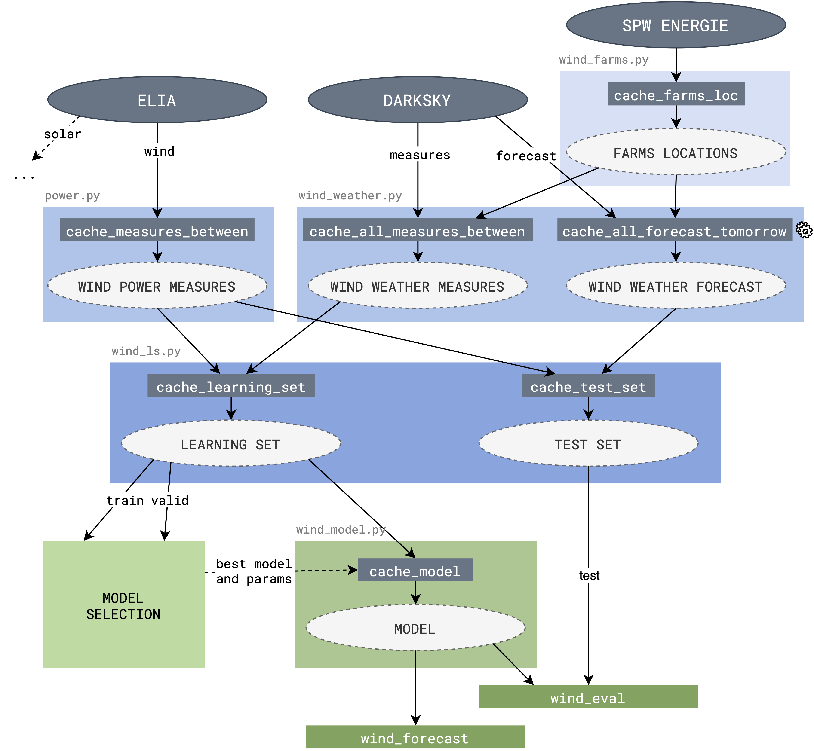

## Solar Power Forecasting

Two scripts can be executed to get an estimation of the solar power that will be produced tomorrow in the province of Liège:

- `solar_panelwise.py`: **estimate tomorrow's production** by computing a power curve for each panel installation detected by our panel enumerator.
- `solar_provincial.py`: **estimate tomorrow's production** by computing a power curve directly for the whole province, using Elia's production measurements for the past 7 days to build a posterior predictive model.

To evaluate the performance of the models on a given period, one can run `misc/solar_panelwise_eval.py` as well as `misc/solar_provincial_eval.py`.

Both caches present in the computational flow can be updated using the following scripts:

|                Cache | Script to use            |
| -------------------: | ------------------------ |
| SOLAR POWER MEASURES | `cache/power.py`         |
|  IRRADIANCE MEASURES | `cache/solar_weather.py` |
| IRRADIANCE FORECASTS | `cache/solar_weather.py` |

## Wind Power Forecasting

The interface is composed of:
 - `wind_eval.py [-h] [--forecast]`: **evaluate the current cached model** on the validation set, or the test set if the `--forecast` option is used.
 - `wind_forecast.py [-h] [--display]`: **forecast the wind power production** for today and tomorrow, using live weather prediction.

 The different caches of the computation flow can be updated using the following scripts:

| Cache | Script to use |
| -----:|:------------- |
| FARMS LOCATIONS | `cache/wind_farms.py` |
| WIND POWER MEASURES | `cache/power.py` |
| WIND WEATHER MEASURES | `cache/wind_weather.py [--start START] [--end END]` |
| WIND WEATHER FORECAST | `cache/wind_weather.py --forecast` |
| LEARNING SET | `cache/wind_ls.py` |
| TEST SET | `cache/wind_ls.py --test` |
| MODEL | `cache/wind_model.py [--train-set-only]` |

The wind power forecast computation flow is display hereafter.

