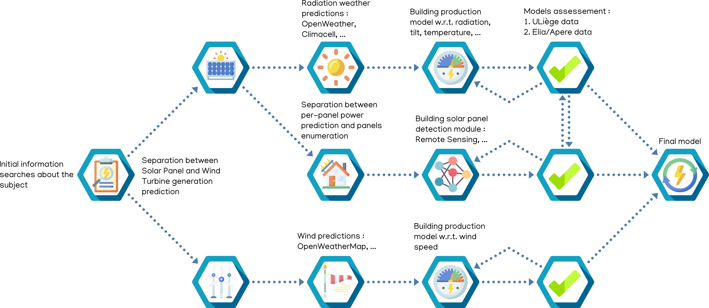
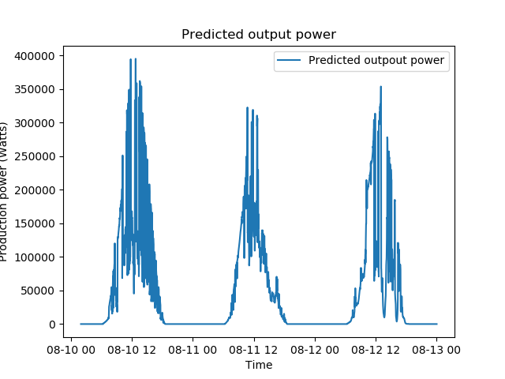
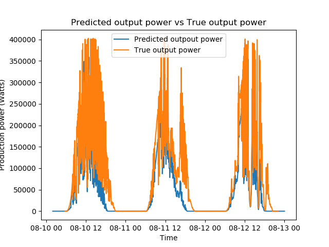
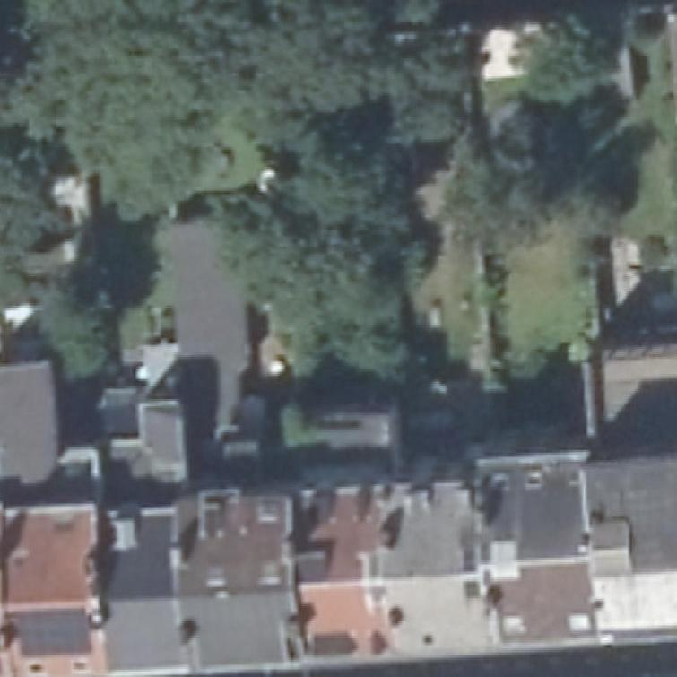
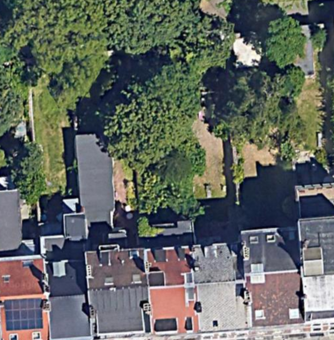

# Renewable Energy Production Forecast



## Photovoltaic panels production

As explained in the last review, the idea was to assess the production of photovoltaic units in Liège by using a theoretical model (and the Python library [`pvlib`][pvlib] if necessary). 

### Parameters to take into account

To derive such a theoretical model, we thought about parameters influencing the production, *i.e.* atmospherical parameters as well as technical parameters on the photovoltaic units. We can thus list:

- The tilt $\beta$ of the panel with respect to the horizontal plane (in degrees)
- The surface azimuth $A_s$ of the panel, *i.e.* the angle between the normal vector to the panel (projected on the horizontal plane) and the North-South line (in degrees, being positive when measured clockwise starting from North)
- The module efficiency, $\eta$ (in %)
- The area of the module, $A$ (in $m^2$)
- The temperature, $T$ (in Celsius degrees)
- The irradiance received by the panel, $I$ (in $W/m^2$)
- The incidence angle, *i.e.* the angle between a sun ray arriving on the panel and the normal vector to the panel, $\theta$ (in degrees)

Combining these parameters, we derived that the output power produced by a photovoltaic panel could be approximated by:

$$
P_{out} = \eta * I * cos(\theta) * A
$$

given in Watts. This output power will be bounded above by the maximum power $P_{max}$ that can be generated by this particular panel. This information can be found on the data sheets of the corresponding panel.

Furthermore, the temperature $T$ influences the maximum power that can be generated by the panel, through a temperature coefficient that can also be found in the data sheets, expressed in %/°C, where basically $P_{max}$ will decrease by a certain percentage per degree.

As the incidence angle $\theta$ is not straightforward to compute, we needed to look up how this angle could be computed from other available information. We discovered thanks to [Itaca](https://www.itacanet.org/the-sun-as-a-source-of-energy/part-3-calculating-solar-angles/) that this angle was a function of several other angles, namely:

- the declination angle $\delta$ (in degrees)
- the latitude of the panel $\phi$ (in degrees)
- the tilt of the panel $\beta$ (as already mentioned, in degrees)
- the surface azimuth $A_s$ indicating the orientation of the panel (in degrees)
- the hour angle $\omega$ (in degrees)

The cosine of the incidence angle can be expressed as:

$$
\cos(\theta) = \sin(\delta)\sin(\phi)\cos(\beta) + \sin(\delta)\cos(\phi)\sin(\beta)\cos(A_s) + \\
\cos(\delta)\cos(\phi)\cos(\beta)\cos(\omega) - \cos(\delta)\sin(\phi)\sin(\beta)\cos(A_s)\cos(\omega) - \\ \cos(\delta)\sin(\beta)\sin(A_s)\sin(\omega)
$$

when $A_s$ is positive when measured clockwise starting from North. The declination and hour angles can be computed using [`pvlib`][pvlib] (at any timestamp) while the latitude will be easy to get as it will be the one of Liège (which we will use in the unit estimation program that we would like to run, if possible).

### Associated assumptions/challenges

The main challenge linked to the photovoltaic production assessment is linked to that of estimating the number of units of production. Indeed, as will be explained in the following section, we would like to enumerate the amount of production units by processing satellite images into some recognition program. 
Nevertheless, if enumerating this amount is a first challenge, discovering the type of panel is another huge one (and is almost impossible to predict). To tackle this issue, several solutions could be considered:

- We could approximate all panels that are detected by the recognition program by the same panel (for example the ones installed in the parkings of the university) in order to get a rough estimation of the panels' efficiency $\eta$ (all panels will thus have the same efficiency). The idea would be the same for the temperature coefficient on the maximum power, as well as for the panels' area.
- For the problem of estimating the panels' efficiency, we could look for a kind of "average efficiency" (and average area) if such information exists.

As estimating the type of panel is an issue, determining the maximum power for each panel is by definition an issue. We could think of estimating an average bound on this maximum power by using PV production data, if such data was available (Elia does not seem to allow such data manipulation/visualization). However, a problem would be that this data would not consider energy that is reinjected in the network, while we are interested in the total production of the photovoltaic units (thus including the reinjected part).

At first sight, it seems that estimating the tilt of the detected PV units is not really possible. We could thus assume an average tilt for all panels, depending on some potential conventional tilt of the roofs. Estimating the surface azimuth should nevertheless be possible to compute, using the positions of the corners of the panels.

One last big challenge remains in finding irradiance forecast data. Indeed, for now, there does not seem to be a free accessible API that allows to give us this information. Contact has been made with APERe to consider the possibility of accessing such data (if they do have it), but no response has been received.

All these challenges are thus subject to research for the following reviews.

### Model example on the Sart-Tilman data

As we have access to information about irradiance in a particular period of time at the university (thanks to the data provided by the thermodynamics laboratory), as well as to production data, we have implemented a model estimating the output power for this considered period. 

As there are 1760 PV units and 10 "main units", we have considered that each unit contained 176 panels. We also have estimated the surface azimuth very roughly.

This resulted in the following figures.





From these, we see that our model is not too bad at estimating the true output power produced by the photovoltaic panels at the Sart-Tilman. However, it seems to underestimate the true production most of the time, potentially indicating that the model lacks some information.

### Objectives

For the coming review, the main goal was to come up with a simple model, yet realistic, that is able to estimate the output power production of the photovoltaic panels at the Sart-Tilman. 

For the next reviews, the idea will mainly be to tackle the issues mentioned in the previous section, *i.e.* to find a workaround for estimating the type of panel, as well as the associated parameters (if possible, otherwise we will need to approximate these) and to try and improve the current model so that it performs better on the photovoltaic units of the Sart-Tilman and so that it can scale to any data that will be provided by the panel recognition program.

## Production units number estimation

### Test set

We found out that the Wallonia region possesses a geographic information website : [WalOnMap](http://geoportail.wallonie.be/walonmap). This website is in fact a hub for a `WebMapService`, *i.e.* a standard protocol for serving georeferenced map images over the Internet.

In fact the available images cover the whole Wallonia with a quite fine resolution (`1px` for `25cm`). Therefore, using the API, we built a first prototype python program to retrieve images.

```bash
$ python3 wms.py 50.637082 5.564001 50
```



Yet, we heard that Google had an API for its mapping services which are even finer resolution.



We will definitely try to obtain an access key.

### Detection model and training set

In the previous report, we talked about using [DeepSolar](https://github.com/wangzhecheng/DeepSolar) as a first solar panel detection network (from satellite imagery). Unfortunately, we noticed while trying to apply it that the network provided wasn't trained. Furthermore, the training and test set isn't publicly available. Also, we noticed that the codes were written with `Python 2.7` which is no longer supported. Therefore, we decided to find another solution.

We found some papers/repositories about solar panels detection from satellite imagery : 

* [DeepSolaris](https://github.com/SB-BISS/DeepSolaris)
* [solar-panel-detection](https://github.com/alan-turing-institute/solar-panel-detection)
* [Automatic solar photovoltaic panel detection in satellite imagery](https://www.researchgate.net/publication/300416092_Automatic_solar_photovoltaic_panel_detection_in_satellite_imagery)
* ...

If the latter(s) presented interesting methods (and results) for detecting solar panel, none made a training set available which is obviously crucial with a neural network. Therefore finding a suitable training set is our number one goal for the coming review.

To do so we have got a few ideas :

1. Annotating ourself satellite pictures with/without solar panels, with [Cytomine](https://cytomine.coop/) for example. The main advantage is that we would be in total control of the annotation paradigm (polygons, coordinates, surface, ...). The obvious drawback is the quantity of dummy work to do. Furthermore we yet have to find *some* solar panels coordinates.
1. Finding a solar panels coordinates dataset for a foreign country (or even Belgium) for example with [OpenStreetMap](https://www.openstreetmap.org). In fact, we already have such dataset for England. Unfortunately, since this is an open source project, the retrieved coordinates are not consistently placed. Indeed, after a quick inspection, we noticed that a **lot** of coordinates are just next to the panels instead of on them. Anyway, we cannot use these data as such since most detection networks are segmentation based, *i.e.* they define if every pixels belong to a solar panel or not, and therefore need a "region" to fit instead of location.

### Objectives

The current main objective is to quickly find a suitable training set and maybe build a simple computer vision detection model.

Actually, finding the solar panels is only the first step. Afterwards, there is still to find their surface (which should be quite straightforward), their orientation and maybe their tilt.

## Wind turbines production

As far as wind power production is concerned, the results are more straightforward to obtain, both for the counting of the wind turbine units and the power production model.

### Wind turbine units census

For now, the data of all the Walloon wind turbines has been collected thanks to a interactive *Google* map provided by the **SPW Energie** ([source](https://www.google.com/maps/d/viewer?mid=1cDXDt7EdSZ2ZmFqgzE20u2ssZbk&ll=50.528576870747024%2C4.166192000000024&z=7)). Unfortunately, this data is only about the wind turbines in production and in construction in 2018 while the installed wind power has increased by 13.97% in 2019 in Wallonia according to APERe ([source](http://apere.org/fr/observatoire-eolien)).

Anyway, this data was quite usefull for building a first model of wind production forecast. It specifies the geographic coordinates, wind turbine brand, type and power, that for each installed wind turbine.

### Wind turbine characteristics

For each unique type of wind turbine in Wallonia, we would like to obtain a power curve in order to predict the power production from the weather data, as explained in the first review. No satisfying dataset has been found, except the information cards from <https://en.wind-turbine-models.com/>. We manually retrieved the URL for each different type of wind turbine in 2018 (about 35 different types), and then a python scraper script retrieved the data for each wind turbine:
- cut-in, cut-out and rated wind speed (from an HTML table available in each wind turbine card)
- power curve (from a JavaScript canvas available in each wind turbine card)

Some of the wind turbine types were not available on this website, and we thus fetched the data manually in this case.

### Wind power production

A different model of production is constructed for each different type of wind turbine. 
- if the power curve was available on the *wind-turbine-models* website, the prediction are made according to a spline interpolation of this power curve between the cut-in and the rated wind speed.
- if the power curve was not available on the website, a naive theoretical model is build using a cubic function between the cut-in and the rated wind speed. 

Below the cut-in and above the cut-out wind speed, the power production is set to 0. Between the rated wind speed and the cut-out wind speed, the power is set to the peak power of this type of wind turbine.

Afterwards, in order to compute the estimated wind power production in the province of Liege during a certain time (e.g. hourly average power), we just have to predict the power for each wind turbine (in the province of Liege) by querying the (hourly average) wind prediction at the wind turbine location and at the specific time of prediction, and then to sum up all of these individual predictions. 

### Weather

The weather conditions are just queried to an API, we are using either [OpenWeatherMap](https://openweathermap.org/) and a Demo version of [Climacell](https://www.climacell.co/weather-api/docs/). The data for making predictions is quite satisfying for now (as far as wind is concerned, solar radiation is a bit harder to get). However, no weather data history was retrieved yet with these two tools.

### Results

As far as the wind is concerned, Elia has data of aggregated wind production over Wallonia, the strategy for assessing our model would thus be to scale up our model of the Liege province to the whole Wallonia, and to compare this to the wind power production recorded by Elia (In comparison, for the solar power production, Elia makes available the data for each province, so that there is no need to scale up our model to assess it).

As no weather data history was retrieved yet, we could not compare the wind power production of our model with the wind power production recorded by Elia.

However, the forecasts that were obtained given the weather conditions seemed to be acceptable.

### Refinements and objectives for the next review

- Getting in touch with the SPW Energie in order to ask for the same data as the one available for 2018, but updated.
- For each different type of wind turbine, getting a power curve in order to get rid of the naive theoretical model
- For each different type of wind turbine, getting the average hub height (the actual height information for each unit was not available in the Wallonia data, but it vary in a range specific to the turbine type)
- Taking into account that the wind at the rotor height should be slightly higher than the wind forecast retrieved from the weather API.

[pvlib]: https://pvlib-python.readthedocs.io/en/stable/
