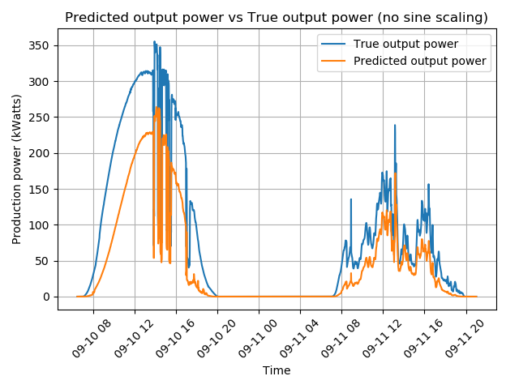
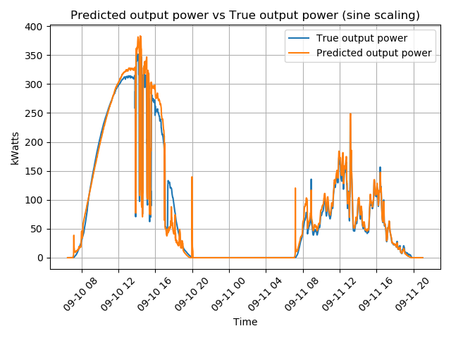
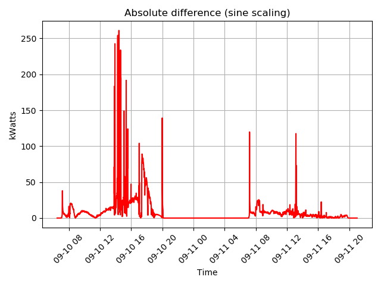
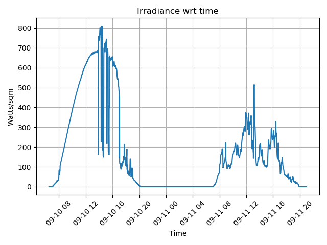
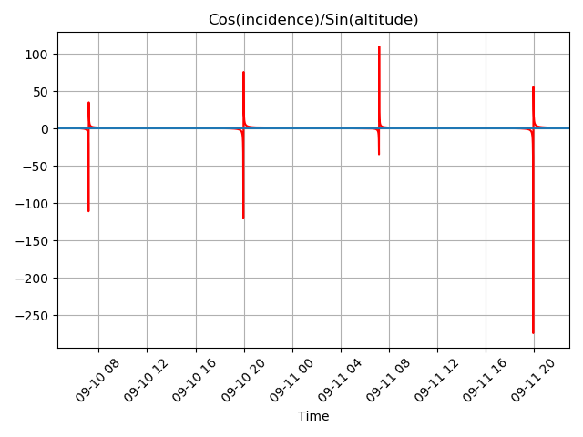
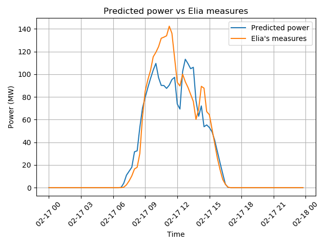
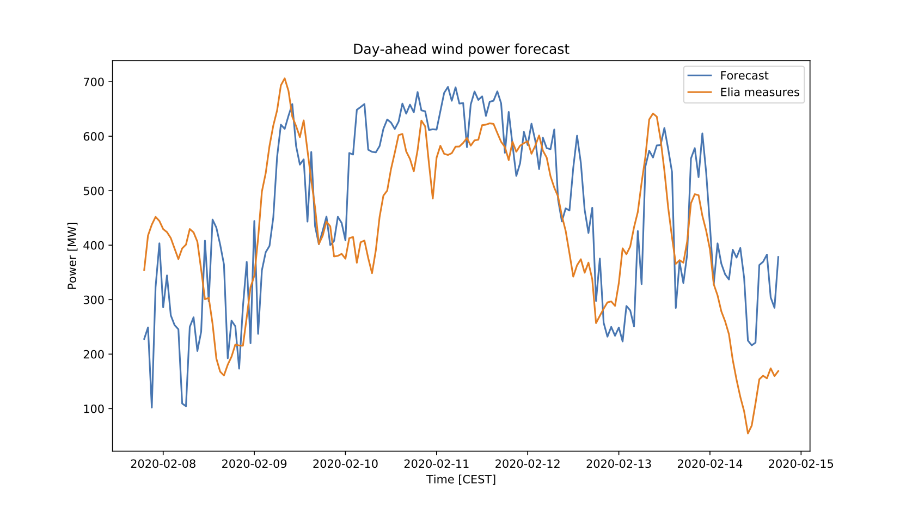

# Renewable Energy Production Forecast

All codes can be found on [this repository][GitHub].

## Photovoltaic panels production

### Improvements of the first model

As was explained during the previous review, the main goals were to further improve the current model, implemented on the photovoltaic units of the Sart-Tilman, *i.e.* to add the maximum power bounding effect as well as the influence of temperature and of the potential missing scaling of the irradiance data.

We decided to implement temperature influence in a unidirectional way, that is, we assumed the maximum power of a panel would only reduce by a coefficient of 0.40%/°C, for each degree above 25°C. Since most of the time, temperatures in Liège do not surpass this bound (except for very hot summer periods), temperature shouldn't have a too big influence on our model.

As far as maximum power bounding is concerned, the implementation is quite straightforward, as all panels installed at the Sart-Tilman are the same, and thus share the same maximum power. Given the total number of units, it is pretty easy to derive the total maximum power of the installation.

Finally, we divided the irradiance (obtained from the thermodynamics laboratory) by the sine of the sun altitude. Indeed, even if there is no information available about how irradiance is measured by the station, we suspected that measures corresponded to the irradiance measured perpendicularly to the ground surface. We thus needed to project these irradiance measures so that they would correspond to the irradiance produced *directly* by the sun rays.

This last improvement seemed to help decreasing the underestimating trend of our model. Nevertheless, it now sometimes overestimates the production at high-irradiance periods of the day. This however depends on the period of the year that is being considered.

Below are figures comparing the previous and new model with respect to the true power production.

### Issues with the current model

As can be noticed on the updated model, some power peaks are present at the end of the day (roughly around 6 o'clock). This seems strange since it corresponds to a period where the sun is setting, and the irradiance should thus not be as high as it was in the middle of the day. We can confirm (or rather infirm) this hypothesis by looking at the irradiance for that particular period of time.

The problem seems to have another source. The only possibility is that it comes from the newly introduced parameter: the sine of the sun's altitude. Since our power formula is given by (without taking into account temperature or maximum power, which have no influence on this issue)

$$
P_{out} = \eta * I * \cos(\theta) * A / \sin(alt)
$$

we can think of plotting the cosine and sine respectively, as well as their ratio.

We see that we have some weird behavior at night. This is simply due to the fact that the power measures made at the Sart-Tilman stop roughly at night. Hence, since we consider a time series corresponding to the moments where measures are recorded, we do not consider night periods in our time series, and thus nor in our sine and cosine.

From these figures, we can clearly see that, at the period where the peaks appear (around 8 o'clock), the sine and cosine are both positive (meaning the sun is rising and is no longer behind the panels) but very small. We also have peaks at night when both are negative (meaning the sun has set and is no longer facing the panels), and this is handled by forcing the production to be equal to zero when it is the case. The inverse is not true, but is not such a big deal.

### New source of data

Meanwhile, a new source of data has been found, through the [CAMS][CAMS] database. This database provides radiation data (among which: clear sky radiation, **global horizontal radiation**, etc.) in Europe with a granularity of 15 minutes to even 1 minute, up to two days from the current date.

In order to make requests to this database, we use a client application implemented in Python by [Giorgio Balestrieri][Giorgio Balestrieri].

### Attempt for a new model

We also tried to derive a very simplistic model from the available [data][data] on the photovoltaic installations in the province of Liège. This file contains, among others, the maximum power for each municipality in the province of Liège (dated around 2018).

From this, we computed the total maximum power available in Liège, and derived from this value the *average* photovoltaic area available in Liège, by dividing the maximum power by the average area of panels per kWPeak (which we found to be around [7][7]).

With this average photovoltaic area and with the radiation data retrieved from the CAMS database, we are able to derive an estimation of the production power of the province of Liège, through the following formula:

$$
P_{out} = \eta * A * I
$$

where $A$ is the average photovoltaic area ($m^2$), $I$ is the radiation ($W/m^2$) and $\eta$ is the panel efficiency.

For the example models, $\eta$ has been arbitrarily set to 0.15. The idea is to compare the computed power (for any time period) with the measures done by [Elia][Elia]. An important remark is that we don't know with full certainty what the measures done by Elia correspond to, but we assumed that they corresponded to the power produced by the photovoltaic panels and reinjected in the network, while the power we compute corresponds to the whole production potential. The following figure was obtained.

### What should be done in the future

Two main aspects are still not implemented in the current models.

The first aspect concerns rather our initial model (Sart-Tilman) than the new provincial model. The code should be made more modular w.r.t. the tilt, surface azimuth, panel areas that we would like to compute with our panel recognition program. That is, we would like to have a code consisting of different functions that would take as input such quantities. However, since this modularity will highly depend on how the recognition program will try to compute these parameters (and also on how it will output these results, *i.e.* panel per panel, etc.), it is not yet very possible to make it as modular as we would have wished.

The second aspect concerns the parameter estimation that we had evoked last time. Concerning the maximum power, it seems that it will not play a big role in the model that we would like to derive, at least for the Sart-Tilman model. However, the panel efficiency plays a bigger role, and is still approximated to a constant value for now (which is correct for the Sart-Tilman's case). An idea that will be exploited is to try and build a model (from the second simplistic model) with [PyStan][Pystan] in order to take into account uncertainty about the efficiency, the area per kWPeak, etc. and to fit it to the measures made by Elia.

Finally, we still haven't found a reliable irradiation data forecast API. Indeed, we have access to data provided by [Climacell][Climacell] but they seem to be not that accurate.

## Production units number estimation

### Testing set

As said in the previous review, we wanted to obtain an access key for the Google Maps API. Unfortunately, this service wasn't free as we first thought.

Google also proposes an API called [Google Earth Engine](https://earthengine.google.com/) combinig a multi-petabyte catalog of satellite imagery and geospatial datasets, like Nasa's [Landsat](https://landsat.gsfc.nasa.gov/) and Esa's [Sentinel](https://sentinel.esa.int/web/sentinel/home). Unfortunately, after *days of work* to integrate this API within our scripts, we realized that none of the available satellite imagery had a sufficient resolution for Belgium.

At the end of the day, the [WalOnMap](https://geoportail.wallonie.be/walonmap) imagery is still our best choice.

### Learning set

Eventually, we found a suitable learning set : [Distributed Solar Photovoltaic Array Location and Extent Data Set for Remote Sensing Object Identification](https://figshare.com/collections/Full_Collection_Distributed_Solar_Photovoltaic_Array_Location_and_Extent_Data_Set_for_Remote_Sensing_Object_Identification/3255643)

This dataset contains the geospatial coordinates and border vertices for over `19 000` solar panels across `601` high resolution (`5000x5000`) images from four cities in California.

> Modesto city, zoomed 10 times

The geospatial coordinates are very precise and provided as polygon **vertices**. We implemented the file `learing_set.py` in order to

1. transform the polygons into black and white *classification* images. These will be very handy in the training phase.
2. slice the images into smaller images (`256x256`) as most neural networks cannot work at full resolution.

#### Data augmentation

We plan to **rotate** and **translate** these images in order to increase the quantity of available training data.

### Objectives

Now that we have both suitable learning and testing sets, we are ready to build our first detection model(s) !

## Wind production

As the physical wind model built for last review was performing quite badly, using tools such as `pystan` to measure the influence of the uncertainty is not relevant yet. However, as soon as our model reach better results, we could take into account this uncertainty.

In order to improve the forecasting of the wind power, we decided to train a model to compensate for the difference between our physical model and the measure of Elia.

### Data acquired

Using the `darksky` weather API (and a lot a different free api keys), we collected hourly wind data for a single location in Wallonia, from 2012 to now.

From this data, we ran our physical model on each hourly wind measure (using thus a single location as input) from 2012 to now.

Using a python script, we downloaded and aggregated all the wind power data available from [Elia]. It consists in a measures of produced wind power every 15 minutes from 2012 to now.

Once again, we have been able to verify that the physical model is not inconsistent with the measures, but is not good at forecasting with high accuracy.

### Models

The aim of the model is to predict the difference between our physical model and the measure of elia. Alternatively, we could choose to predict the measure of elia using (among others) the physical model as a feature. In this case, the input would thus be a three dimensional time series constituted of:

- the datetime
- the wind
- the output of the physical model (that is deterministically based on the wind)

and the output be the measures of elia that have been collected.

Given the nature of the discrepancy between our physical model and the measures of elia, we had the intuition that a simple model that would even not take into account the temporal nature of the samples should be able to give good results. 
Indeed, just training a random forest on the aforementioned inputs and outputs has given us far better results than the physical model. Even when training it on a one year dataset.
It is important to note that this model uses the wind data at a single location (and the physical model is based on the wind at a single location), uses a SL method that does not take the temporal correlation into account, which is encouraging for the future.

### First results

### Future models

There are several possibilities that will be considered for the next models:

- having a look at Gaussian processes with appropriate kernels (adapted to wind and wind power)
- having a look at LSTM recurrent networks 
- using the wind data from several locations as input (or even one for each wind turbine location), since this was already helping a lot with the physical model
- Using as inputs the time series of the physical model of each wind turbine separately instead of the aggregated power. Alternatively, grouping them by power plan, or by wind turbine model.
- using an additional variable indicating the wind MW peak installed over time (from APERe)

[GitHub]: https://github.com/lgaspard/renewable-energy-production-forecast
[data]: https://github.com/lgaspard/renewable-energy-production-forecast/tree/master/data/solar
[CAMS]: https://github.com/lgaspard/renewable-energy-production-forecast/tree/master/data/solar
[7]: https://energieplus-lesite.be/concevoir/photovoltaique/predimensionner-l-installation/
[Giorgio Balestrieri]: https://github.com/GiorgioBalestrieri/cams_radiation_python
[Elia]:elia.be/fr/donnees-de-reseau/production/production-photovolt
[Climacell]:https://developer.climacell.co/docs
[Pystan]:https://pystan.readthedocs.io/